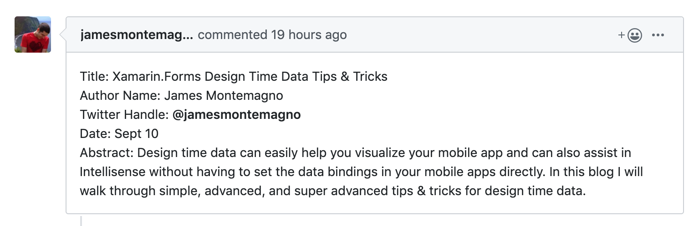

# The October Xamarin Best Practices Challenge

This is the official repository for the October Xamarin Challenge. More details about the announcement can be found on the [blog post.](https://medium.com/@claudiosanchez/the-september-xamarin-best-practices-challenge-819e098c8314)

Below is a **Work-in-progress** Table of Contents (ToC). Feel free to (1) submit a Pull Request with changes of your own to the ToC, or (2) reach out to me via Twitter (@ClaudioASanchez), if you are not sure. 

## Table of Contents

* Setting up your project
    * Anatomy of the Visual Studio Solution

* UI
    * Styling
    * Controls
    * Theming
    * How to 

* MVVM Frameworks

* Validation

* Web Services
    * Consuming Web services

* Data
    * Using local data in a mobile app
    * Offline Data
        * Caching
        * Synchronization with backend

* Using Phone Capabilities
    * GPS/Geolocation

* Push Notifications

* Continuous Integration/Continuous Delivery
    * Getting Started wit Microsoft App Center 
    * Distributing Apps with App Center
    * App Store publication
    * Beta Testing via App Stores 

* Advanced Topics
    * Feature Flags

* Testing 
    * UI Testing Basics 
    * App Center Test
    * Advanced Topics
        * Best Practices for UI Testing of Xamarin-based Apps

* Monitoring
    * App Analytics
    * Telemetry 

* API Best Practices

## How Do I sign up for this?

Reserve a spot by submitting an [issue](https://github.com/claudiosanchez/OctoberXamarinChallenge/issues/new) on the repo, as shown on the image below. Please make sure you have the following fields: Title, Author Name, Twitter Handle, Date, and Abstract. 

Once reviewed and approved (by labeling it approved) we will update the Table of Content with your topic, as well as updating the Calendar.

## Calendar

|Day| Article | Author |
|--|--|--|
|1|||
|2|||
|3|||
|4|[Please connect to my API: Using Refit to consume REST services on Xamarin Forms](https://github.com/claudiosanchez/OctoberXamarinChallenge/issues/4)|Carlos Campos|
|5|[Release made easy with Appcenter](https://github.com/claudiosanchez/OctoberXamarinChallenge/issues/2)|Raul Montero|
|6|[Crashing gracefully and reporting like a pro with AppCenter](https://github.com/claudiosanchez/OctoberXamarinChallenge/issues/3)|Enmanuel Toribio|
|7|||
|8|||
|9|[Monitor your apps in the wild with Azure Application Insights](https://github.com/claudiosanchez/OctoberXamarinChallenge/issues/5)|Yhorby Matias|
|10|[Xamarin.Forms Design Time Data Tips & Tricks](https://github.com/claudiosanchez/OctoberXamarinChallenge/issues/7)|James Montemagno|
|11|||
|12|||
|13|[Getting Started with Microsoft App Center](https://github.com/claudiosanchez/OctoberXamarinChallenge/issues/9)|Trevor Tirrell|
|14|||
|15|||
|16|||
|17|||
|18|||
|19|||
|20|||
|21|||
|22|||
|23|||
|24|||
|25|||
|26|||
|27|[Authentication using Microsoft App Center](https://github.com/claudiosanchez/OctoberXamarinChallenge/issues/10)|Trevor Tirrell|
|28|||
|29|||
|30|[Roll out features with the click of a button with Feature Flags](https://github.com/claudiosanchez/OctoberXamarinChallenge/issues/1)|Claudio Sanchez|

